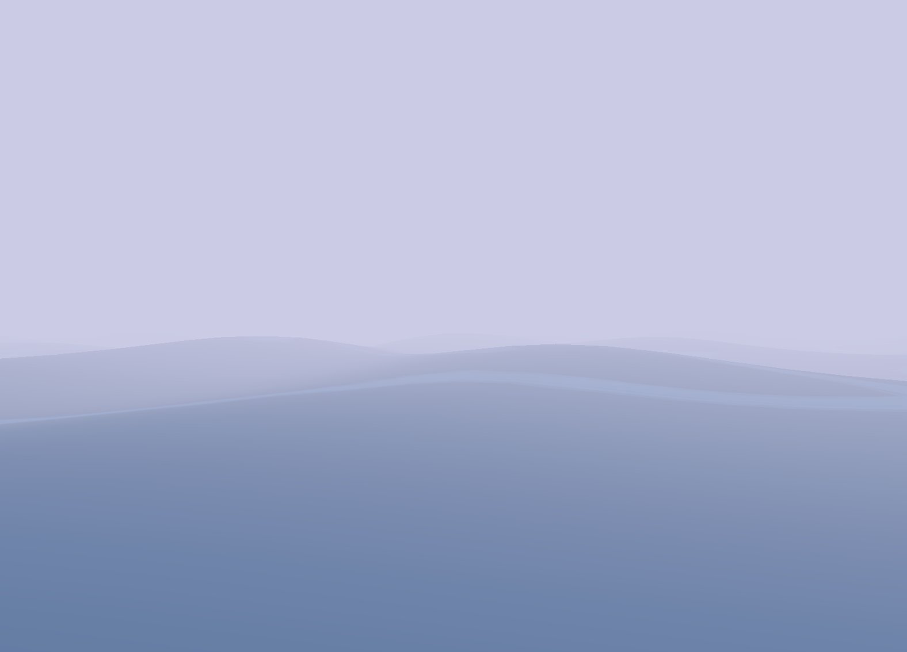
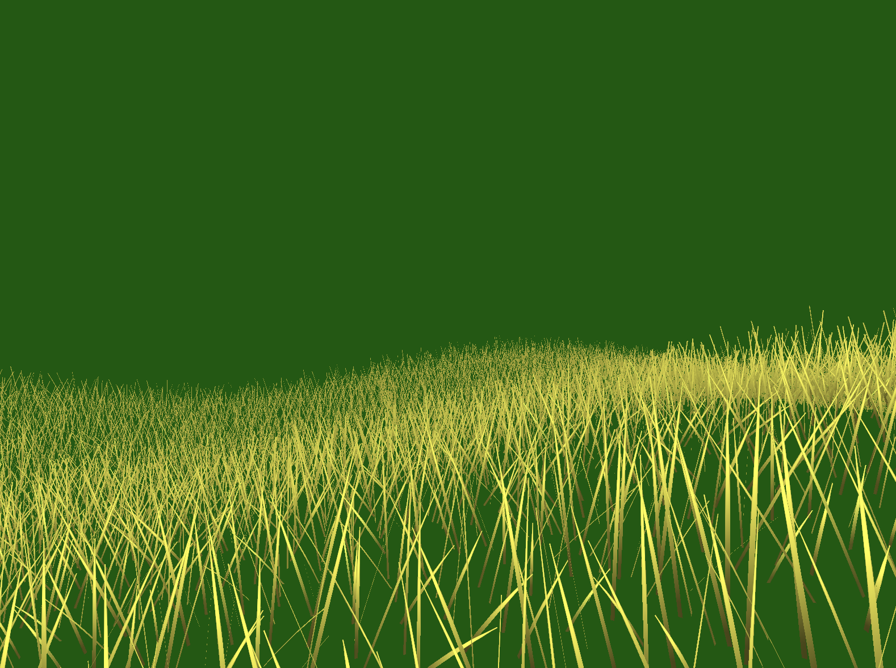
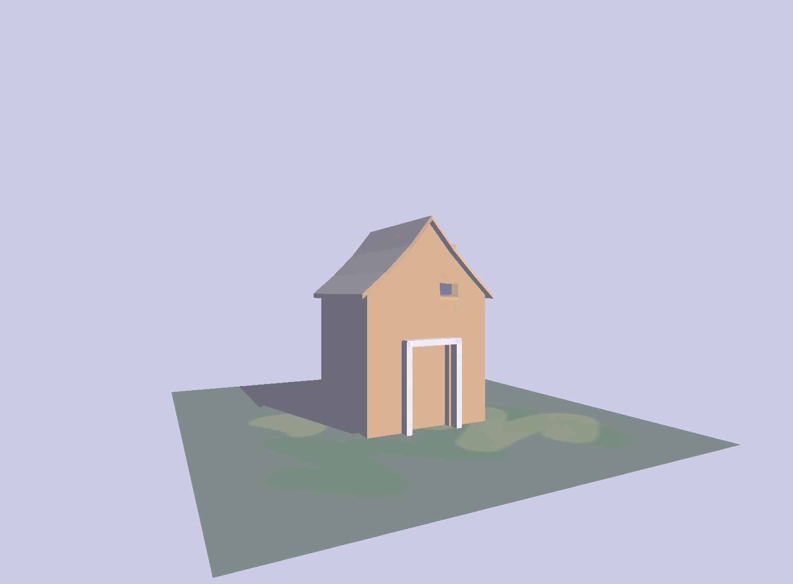
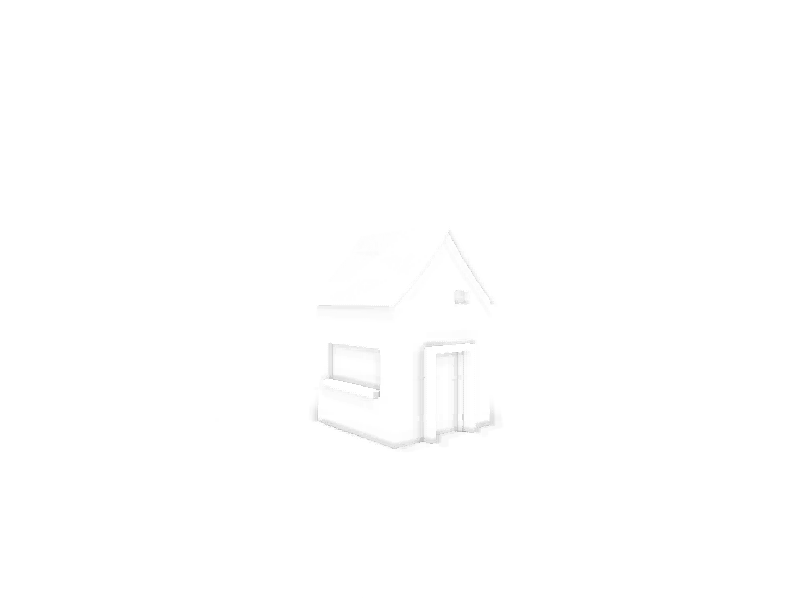

first real time rendering projects in Apple's Metal

a rolling sea
---
    
mostly a clone of [Nathan Gardon's recreation of the ocean in
Zelda The Wind Waker](https://medium.com/@gordonnl/the-ocean-170fdfd659f1)
with some added fog.

grass
---
 
generated in a mesh shader

grass geometry generation based on:
based on https://hal.inria.fr/inria-00087776/PDF/RR-5960.pdf Kadi Bouatouch, Kévin Boulanger, Sumanta Pattanaik. Rendering Grass in Real Time with Dynamic Light Sources. [Research Report] RR-5960, INRIA. 2006, pp.36. ffinria-00087776v2

but without any of the LOD system described there.

house
---

load and render obj model with shadow mapping

using MDLAsset to load obj model and matrix Math from 
https://github.com/SamoZ256/MetalTutorial/blob/main/MetalTutorial9/MetalTutorial/Math.swift
results in inverted x-values, so model matrix flips them back again

Screen Space Ambient Occlusion

render depth and normal to texture
then in a screen space pass, reconstruct view position and normal, take samples in a hemisphere around the normal and compare with the recorded depth.

finally apply a screen space edge preserving blur (Kuwahara filter)

